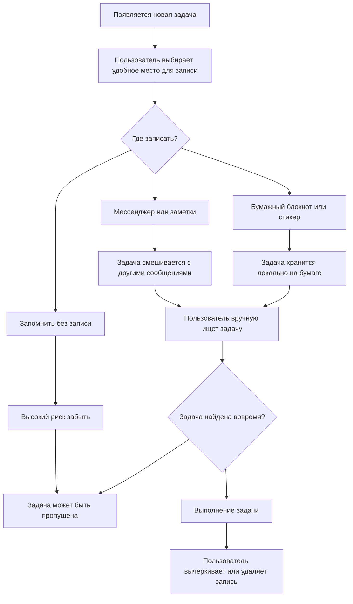
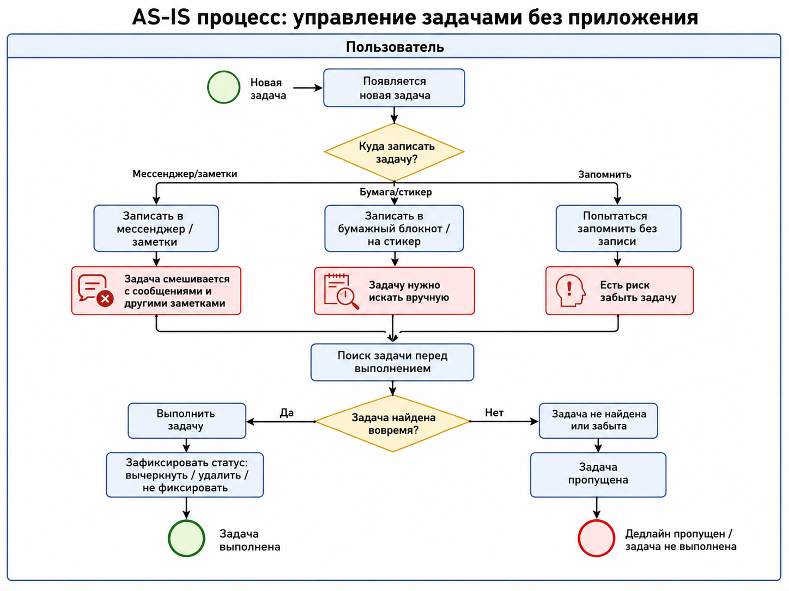
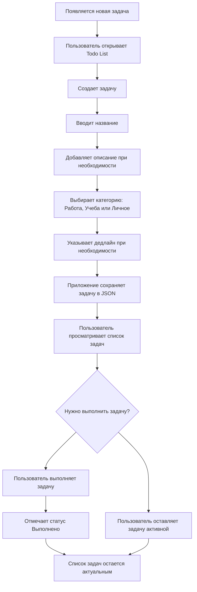
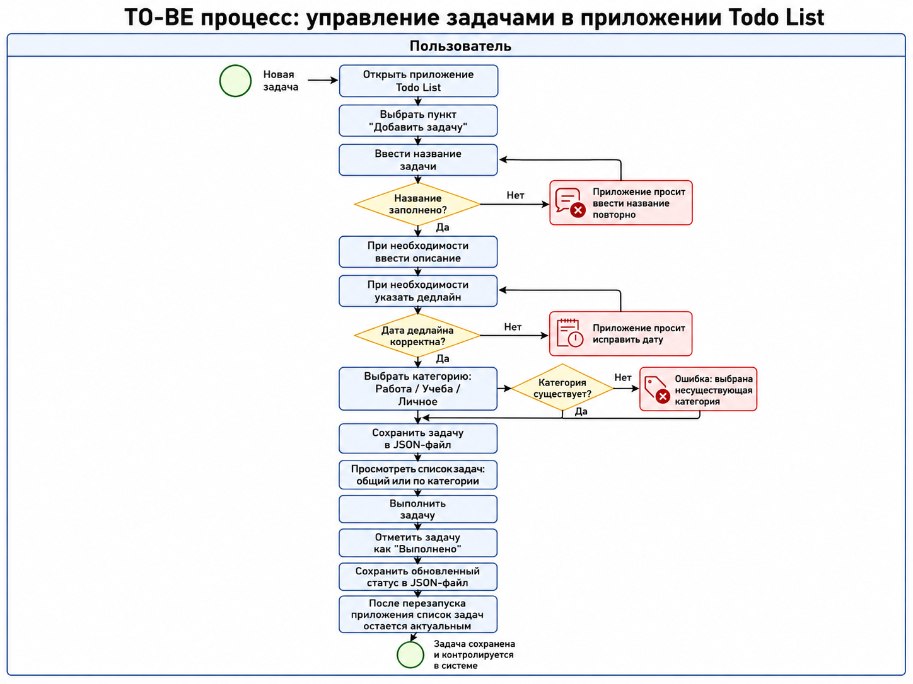

# Лабораторная работа №2. Проектирование и управление требованиями

## Тема проекта

Персональный менеджер задач (Todo List) с категориями.

## Цель проектирования

На основе исследования из лабораторной работы №1 формализовать требования к будущему прототипу, описать пользовательские сценарии, спроектировать основные процессы и подготовить backlog разработки.

## AS-IS: текущий процесс без приложения

Текущий процесс основан на результатах CustDev: пользователи фиксируют задачи в мессенджерах, бумажных списках, стикерах или отдельных заметках.

Готовая диаграмма: [diagrams/as-is.png](diagrams/as-is.png).

Исходник диаграммы в Mermaid: [diagrams/as-is.mmd](diagrams/as-is.mmd).

## TO-BE: будущий процесс с приложением

Будущий процесс предполагает единое консольное приложение, где задача создается, получает категорию и при необходимости дедлайн.

Готовая диаграмма: [diagrams/to-be.png](diagrams/to-be.png).

Исходник диаграммы в Mermaid: [diagrams/to-be.mmd](diagrams/to-be.mmd).

## User Stories

| ID | User Story | Acceptance Criteria |
| --- | --- | --- |
| US-01 | Как пользователь, я хочу добавить задачу с названием, чтобы быстро зафиксировать новое дело. | Задача создается при непустом названии; новая задача получает уникальный ID; задача отображается в общем списке. |
| US-02 | Как пользователь, я хочу добавить описание к задаче, чтобы сохранить подробности выполнения. | Описание можно оставить пустым; описание отображается при просмотре задачи; описание можно изменить. |
| US-03 | Как пользователь, я хочу указать дедлайн, чтобы понимать, когда задача должна быть выполнена. | Дедлайн можно не указывать; дата вводится в понятном формате; некорректная дата не сохраняется. |
| US-04 | Как пользователь, я хочу распределять задачи по категориям, чтобы разделять учебные, рабочие и личные дела. | Доступны категории "Работа", "Учеба", "Личное"; каждая задача относится к одной категории; список можно фильтровать по категории. |
| US-05 | Как пользователь, я хочу редактировать задачу, чтобы исправить ошибку или уточнить данные. | Пользователь может изменить название, описание, дедлайн, категорию и статус; при неверном ID выводится сообщение об ошибке. |
| US-06 | Как пользователь, я хочу отмечать задачу выполненной, чтобы видеть актуальный прогресс. | Статус задачи меняется на "Выполнено"; выполненная задача остается в списке; статус сохраняется после перезапуска приложения. |
| US-07 | Как пользователь, я хочу удалять задачу, чтобы убирать неактуальные дела из списка. | Задача удаляется по ID; при неверном ID выводится сообщение; после удаления задача не отображается в списке. |

## Use Case: создание задачи с категорией и дедлайном

### Участники

- Основной актор: пользователь.
- Система: консольное приложение Todo List.

### Предусловия

- Приложение запущено.
- Доступен файл хранения JSON или приложение может создать его автоматически.

### Основной поток

1. Пользователь выбирает пункт меню "Добавить задачу".
2. Система запрашивает название задачи.
3. Пользователь вводит название.
4. Система запрашивает описание.
5. Пользователь вводит описание или оставляет поле пустым.
6. Система запрашивает дедлайн.
7. Пользователь вводит дату или оставляет поле пустым.
8. Система показывает список категорий.
9. Пользователь выбирает категорию.
10. Система создает задачу со статусом "Активно".
11. Система сохраняет обновленный список задач в JSON.
12. Система показывает сообщение об успешном добавлении.

### Альтернативные потоки

- A1: Пользователь оставил название пустым. Система сообщает, что название обязательно, и предлагает ввести его повторно.
- A2: Пользователь ввел некорректную дату. Система сообщает о неверном формате и просит повторить ввод.
- A3: Пользователь выбрал несуществующую категорию. Система сообщает об ошибке и не сохраняет задачу.
- A4: Файл JSON отсутствует. Система создает новый файл при первом сохранении.
- A5: Файл JSON поврежден. Система должна сообщить об ошибке загрузки данных и не потерять существующий файл.

## Wireframe

Низкодетализированный прототип интерфейса представлен в файле [wireframes.md](wireframes.md).

Ключевые экраны:

- главное меню;
- просмотр списка задач;
- добавление задачи;
- редактирование задачи;
- фильтр по категории.

## Backlog

| Приоритет | Элемент backlog | Тип | MVP |
| --- | --- | --- | --- |
| 1 | Создать структуру консольного .NET-проекта | Техническая задача | Да |
| 2 | Создать модель задачи с полями ID, название, описание, дедлайн, статус, категория | Функция | Да |
| 3 | Создать модель категории и фиксированные категории "Работа", "Учеба", "Личное" | Функция | Да |
| 4 | Реализовать добавление задачи | Функция | Да |
| 5 | Реализовать просмотр всех задач | Функция | Да |
| 6 | Реализовать редактирование задачи | Функция | Да |
| 7 | Реализовать удаление задачи | Функция | Да |
| 8 | Реализовать отметку задачи как выполненной | Функция | Да |
| 9 | Реализовать фильтрацию задач по категории | Функция | Да |
| 10 | Реализовать сохранение задач в JSON | Функция | Да |
| 11 | Реализовать загрузку задач из JSON при старте приложения | Функция | Да |
| 12 | Добавить обработку ошибок ввода | Улучшение | Да |
| 13 | Добавить сортировку задач по дедлайну и статусу | Улучшение | Нет |
| 14 | Добавить поиск задач по названию | Улучшение | Нет |
| 15 | Добавить статистику по выполненным задачам | Улучшение | Нет |
| 16 | Добавить unit-тесты для бизнес-логики | Техническая задача | Нет |

## MVP

Минимально жизнеспособная версия должна включать:

- консольное меню;
- создание задачи;
- просмотр задач;
- редактирование задачи;
- удаление задачи;
- отметку выполнения;
- категории "Работа", "Учеба", "Личное";
- сохранение и загрузку данных из JSON.

Без этих функций продукт не решает основную проблему пользователя: быстро записать задачу, найти ее по контексту и не потерять после закрытия приложения.

## Нефункциональные требования

- Приложение должно запускаться локально без регистрации пользователя.
- Данные должны храниться в локальном JSON-файле.
- Интерфейс должен быть понятен без дополнительной инструкции.
- Ошибочный ввод не должен приводить к аварийному завершению приложения.
- Код должен быть разделен минимум на слои представления, бизнес-логики и данных.

## Использование AI

AI-ассистент использовался как аналог GitHub Copilot для:

- генерации критериев приемки для User Stories;
- уточнения основного и альтернативных потоков Use Case;
- подготовки структуры backlog;
- формализации AS-IS и TO-BE процессов.
